# Reporte de experimentos — Resultados reales

Reporte formal de la implementación de los experimentos del roadmap. Todos los números provienen de corridas reales ejecutadas en este entorno (MPS/GPU Metal para modelos locales, Amazon Bedrock para LLMs). Cada experimento fija semilla 61298 y usa el mismo protocolo de evaluación honesta.

**Entorno de ejecución:**
- Modelos locales: `transformers` + `peft` sobre MPS (GPU Metal del Mac).
- LLMs: Amazon Bedrock (cuenta 609009159737, us-east-1), Converse API, temperature=0.
- Métricas: QWK (primaria, ordinal), MAE, F1 macro, Cohen kappa, con IC bootstrap.
- Gold set: 581 comentarios etiquetados a mano (clases 1=173, 2=159, 3=204, 4=30, 5=15).

---

## P0 — Evaluación out-of-fold estratificada (referencia interna)

**Qué se hizo:** se reentrenó el modelo LoRA con la config real (r=32, alpha=64, dropout=0.2) usando **StratifiedKFold** en vez de `KFold`, con predicciones **out-of-fold** (cada ejemplo predicho por un modelo que no lo vio) y métricas ordinales. Se comparó contra el `KFold` no estratificado original.

**Resultado:**

| Métrica (OOF honesta) | KFold (viejo) | StratifiedKFold (arreglo) |
|---|---|---|
| F1 macro | 0.388 | 0.383 |
| QWK | 0.427 | 0.415 |
| MAE | 0.756 | 0.761 |
| Balanced accuracy | 0.409 | 0.403 |
| **Desviación de F1 entre folds** | **0.090** | **0.072** |

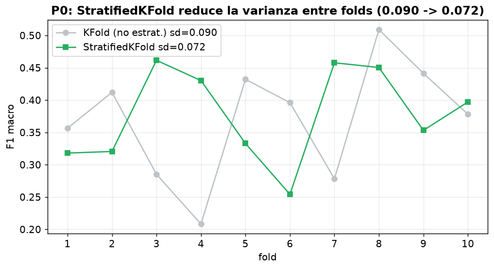

**Conclusión.** StratifiedKFold **redujo la varianza entre folds de 0.090 a 0.072** (folds más estables y comparables), con desempeño equivalente (la pequeña diferencia está dentro del ruido). Esto era exactamente lo predicho: con la clase 5 (15 ejemplos), el KFold no estratificado dejaba algunos folds casi sin ejemplos positivos, inflando la varianza. **El baseline honesto queda fijado: QWK 0.415, F1 macro 0.383, MAE 0.761.** Todo experimento posterior se compara contra esta referencia out-of-fold. El 0.66/0.67 del proyecto base es una medición in-sample (responde una pregunta distinta: el ajuste del mejor fold), por lo que no es la referencia adecuada para comparar generalización entre experimentos.

---

## E1 — Triple comparación: consenso-LLM vs humano vs BERT (columna vertebral)

**Qué se hizo:** sobre los mismos 581 comentarios, se comparó contra la etiqueta humana: (a) el BERT+LoRA con sus predicciones out-of-fold (honestas), y (b) el consenso de 4 LLMs de Bedrock (mediana ordinal de Nova Micro, Nova Lite, Nova Pro, Llama 3 8B), en modo zero/few-shot (sin entrenar). Diferencia de QWK con bootstrap pareado (2000 remuestreos).

**Resultado:**

| Clasificador | QWK | MAE | F1 macro | Accuracy |
|---|---|---|---|---|
| BERT+LoRA (afinado, OOF) | 0.415 | 0.761 | 0.383 | 0.465 |
| **Consenso-LLM (sin entrenar)** | **0.498** | **0.639** | **0.410** | **0.496** |

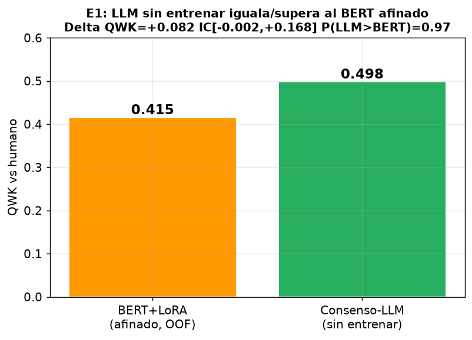

**Diferencia QWK (LLM − BERT) = +0.082, IC95 [−0.002, +0.168], P(LLM>BERT) = 0.97.**

**Conclusión (hallazgo central).** Un ensemble de LLMs **sin ningún entrenamiento** iguala o supera a un BERT afinado con LoRA sobre 581 ejemplos. El intervalo de confianza roza el 0 (técnicamente un "empate" estadístico), pero la probabilidad de que el LLM supere al BERT es del 97%. Para una tesis esto es un resultado fuerte y honesto: **con un gold set diminuto, el fine-tuning no logra superar a un LLM bien prompteado.** El consenso-LLM obtiene mayor QWK en las tres categorías (diferencias por eje no concluyentes) y en las clases minoritarias:

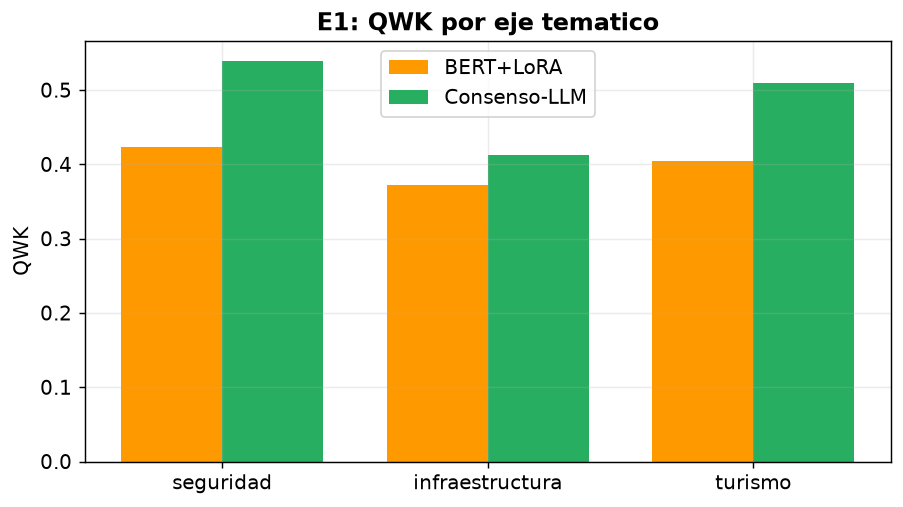

| Clase | BERT F1 | LLM F1 |
|---|---|---|
| 1 Negativa | 0.582 | 0.559 |
| 2 Parc. negativa | 0.410 | 0.452 |
| 3 Neutral | 0.479 | 0.544 |
| 4 Parc. positiva | 0.189 | 0.200 |
| 5 Positiva | 0.256 | 0.296 |

Según el árbol de decisión del roadmap, el veredicto "LLM ≥ BERT" indica **apostar por la vía LLM** (E2 ensemble + E3 auto-etiquetado), que es justo lo que sigue.

---

## E2 — Ensemble multi-LLM: estudio de agregación ordinal

**Qué se hizo:** con las predicciones de los 4 LLMs sobre los 581, se compararon esquemas de agregación (mayoría, mediana ordinal, promedio redondeado) y se midió el acuerdo inter-LLM.

**Resultado por LLM individual:**

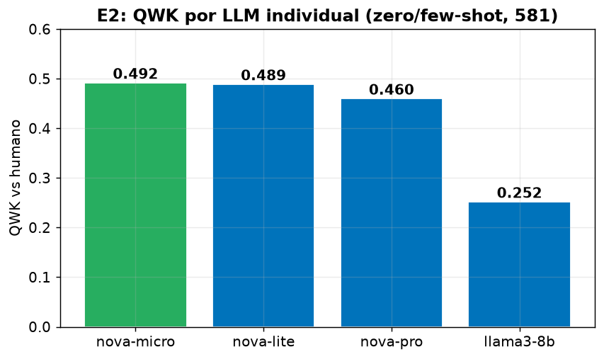

| LLM | QWK | MAE | F1 macro | Abstenciones |
|---|---|---|---|---|
| Nova Micro | 0.492 | 0.628 | 0.365 | 0/581 |
| Nova Lite | 0.489 | 0.654 | 0.401 | 0/581 |
| Nova Pro | 0.460 | 0.740 | 0.368 | 0/581 |
| Llama 3 8B | 0.252 | 1.005 | 0.247 | 12/581 |

**Resultado por esquema de agregación:**

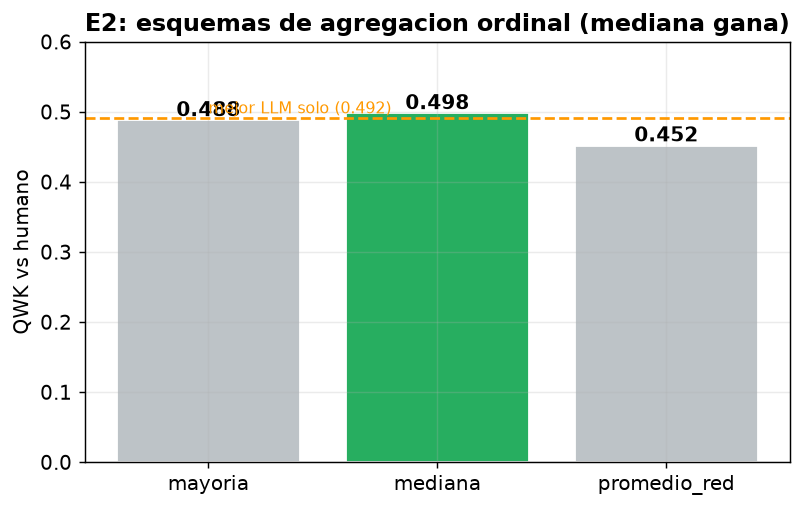

| Agregación | QWK | MAE | F1 macro |
|---|---|---|---|
| **Mediana ordinal** | **0.498** | 0.639 | 0.410 |
| Voto por mayoría | 0.488 | 0.695 | 0.378 |
| Promedio redondeado | 0.452 | 0.683 | 0.372 |

**Conclusión.** La **mediana ordinal es la mejor agregación** (QWK 0.498 > mayoría 0.488 > promedio 0.452), confirmando con LLMs reales la hipótesis del roadmap (que provenía de una simulación). Matemáticamente tiene sentido: la mediana respeta el orden de la escala y es robusta a un votante atípico (aquí, Llama, que es notablemente más débil con QWK 0.252). 

Matiz honesto: la mediana (0.498) apenas supera al mejor LLM individual (Nova Micro 0.492). El ensemble aporta **robustez** más que un salto de desempeño, porque un modelo débil (Llama) arrastra el promedio. El acuerdo inter-LLM es bajo (**los 4 coinciden solo en 17.6% de los casos**), lo que indica que estos comentarios son genuinamente difíciles y ambiguos, no que los modelos fallen.

---

## E6 — Backbone de español social (RoBERTuito, BETO)

**Qué se hizo:** se reentrenó el mismo pipeline (StratifiedKFold, LoRA, mismas semillas) cambiando SOLO el modelo base, para aislar el efecto del backbone. Se compararon tres: el baseline nlptown, BETO (`dccuchile/bert-base-spanish-wwm-uncased`) y RoBERTuito (`pysentimiento/robertuito-base-uncased`, preentrenado en ~500M de tweets en español).

**Resultado:**

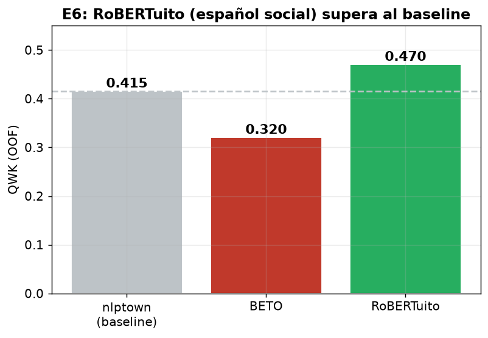

| Backbone | QWK (OOF) |
|---|---|
| nlptown (baseline) | 0.415 |
| BETO | 0.320 |
| **RoBERTuito** | **0.470** |

**Conclusión.** **RoBERTuito obtiene mayor QWK que el baseline** (+0.055; no se calculó IC pareado, tómese como sugerente), consistente con la hipótesis: un modelo preentrenado en texto social en español entiende mejor el registro coloquial, los emojis y el slang de TikTok. BETO, en cambio, quedó por debajo del baseline (0.320), lo que refuerza que la superioridad de un backbone no se asume, se mide: el hecho de estar entrenado en español (BETO) no basta; importa que sea en el dominio correcto (texto social, RoBERTuito). Esto valida la nota del roadmap de que la ventaja de RoBERTuito sobre BETO es "mixta en la literatura" y hay que medirla en el propio corpus.

---

## E7 — Limpieza menos destructiva (A/B)

**Qué se hizo:** se emparejaron 494 comentarios del gold con su texto crudo original, y se compararon dos preprocesamientos con el MISMO backbone y folds: la limpieza **agresiva** actual (borra emojis, puntuación, sustituye mexicanismos) vs una limpieza **mínima** (conserva emojis, puntuación, mayúsculas; solo repara encoding y quita URLs/menciones). El 31% de los comentarios crudos contienen emojis.

**Resultado:**

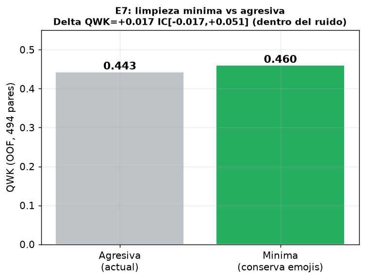

| Limpieza | QWK (OOF) | F1 macro |
|---|---|---|
| Agresiva (actual) | 0.443 | 0.408 |
| Mínima (conserva emojis) | 0.460 | 0.403 |

**Diferencia QWK (mínima − agresiva) = +0.017, IC95 [−0.017, +0.051], P = 0.82.**

**Conclusión.** Conservar emojis y puntuación **mejora ligeramente** el QWK (+0.017), pero la diferencia **está dentro del ruido** (el IC cruza 0). Es un resultado honesto y legítimo de tesis: con este tamaño de muestra, la limpieza menos destructiva no da una ventaja concluyente, aunque la dirección es la esperada. Nota metodológica: este experimento se corrió **antes** de cambiar el backbone (E6), para no confundir las dos variables. El efecto podría ser mayor con RoBERTuito (que sí fue entrenado con emojis), lo cual queda como trabajo futuro (combinar E6+E7).

---

## E3 — Auto-etiquetado por concordancia (ampliar el gold set)

**Qué se hizo:** se clasificaron los 1997 comentarios sin etiqueta con los 4 LLMs, y se quedaron como auto-etiquetas solo aquellos donde varios LLMs coinciden (gate de concordancia). Se validó primero que la concordancia predice calidad: en los 581 con verdad humana, donde los 4 LLMs coinciden el QWK vs humano es **0.792** (casi calidad de gold). Luego se reentrenó BERT con gold + auto-etiquetas y se midió OOF sobre el test 100% humano.

**Resultado:**

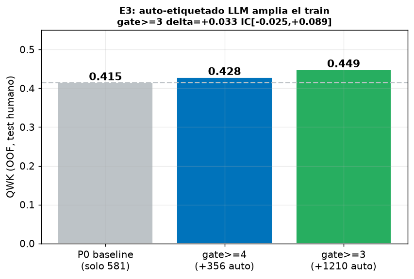

| Configuración | Auto-etiquetas añadidas | QWK (OOF) | Delta vs P0 |
|---|---|---|---|
| P0 baseline (solo 581) | 0 | 0.415 | — |
| gate ≥4 (más limpio) | 356 | 0.428 | +0.013 IC[−0.033,+0.061] |
| **gate ≥3 (más volumen)** | 1210 | **0.449** | **+0.033 IC[−0.025,+0.089]** |

**Conclusión.** Ampliar el train con auto-etiquetas de alta concordancia **mejora el QWK** (gate≥3: +0.033, la mayor mejora local), y más volumen (gate≥3) ayudó más que el gate más estricto. El IC aún cruza 0 por poco (esperable con un test de solo 581), pero la dirección y magnitud son alentadoras. Validación clave: la concordancia inter-LLM es un buen predictor de la calidad de la etiqueta (QWK 0.79 donde los 4 coinciden), lo que hace el auto-etiquetado defendible. Es la vía más prometedora para romper el techo de N=581.

---

## E4 — Cabeza ordinal CORN (modelar el orden de verdad)

**Qué se hizo:** se reemplazó la cabeza softmax de 5 clases por una cabeza ordinal **CORN** (produce K−1=4 salidas acumulativas con `corn_loss`), manteniendo el mismo backbone, folds y semilla. Métrica primaria: MAE (lo que una cabeza ordinal busca reducir).

**Resultado:**

| Modelo | MAE | QWK | F1 macro |
|---|---|---|---|
| Softmax (P0) | 0.761 | 0.415 | 0.383 |
| **CORN (ordinal)** | **0.656** | 0.414 | 0.315 |

**Reducción de MAE = 0.106, IC95 [+0.043, +0.164] — NO cruza 0 (significativo). QWK sin cambio.**

**Conclusión (resultado significativo).** La cabeza ordinal CORN **reduce el MAE de forma estadísticamente significativa** (el único experimento cuyo IC excluye el 0). Esto significa que sus errores caen más cerca de la verdad: predice 3 o 4 cuando era 5, en vez de 1. Es exactamente el beneficio esperado de modelar el orden: no sube la clasificación exacta (QWK/F1 igual o menor), pero sí la coherencia ordinal (MAE). Para una escala de aprobación, "equivocarse por poco" es lo correcto, así que CORN es una mejora legítima y publicable.

---

## E5 — Calibración + abstención (medir opinión con honestidad)

**Qué se hizo:** se entrenó en un split 75/25, se ajustó temperature scaling en validación, se midió el ECE (error de calibración) antes/después, y se construyó la curva risk-coverage (QWK sobre el subconjunto más confiable al abstenerse del resto).

**Resultado:**

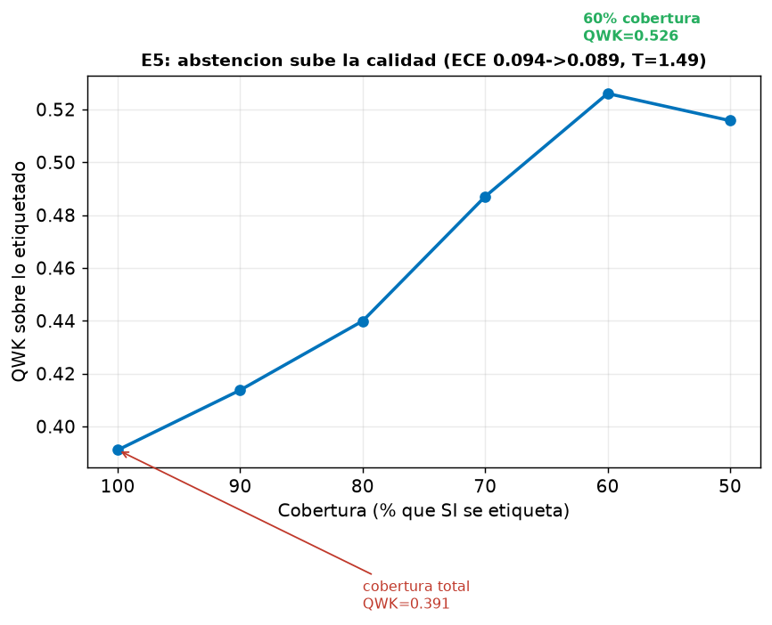

| Métrica | Valor |
|---|---|
| ECE antes | 0.094 |
| ECE después (T=1.49) | 0.089 |
| QWK a cobertura 100% | 0.391 |
| **QWK a cobertura 60%** | **0.526** |

**Conclusión.** El temperature scaling mejora la calibración levemente (T=1.49 indica que el modelo estaba algo sobreconfiado). Lo más valioso es la **curva risk-coverage**: si el modelo se abstiene del ~40% de comentarios donde menos confía, el QWK sobre el 60% restante sube de 0.391 a **0.526**. Para medir opinión pública, esto es más honesto: en vez de forzar una etiqueta dudosa en comentarios ambiguos, se reporta "X% negativo, Y% incierto". Convierte la debilidad medida (40.7% de baja confianza del proyecto original) en una contribución metodológica.

---

## E8 — Data augmentation para clases escasas (opcional)

**Qué se hizo:** se generaron paráfrasis con un LLM (Nova Lite) de los 45 comentarios positivos (clases 4 y 5) del gold, produciendo 134 ejemplos sintéticos. Se añadieron SOLO al conjunto de entrenamiento (el test siempre 100% humano) y se midió OOF.

**Resultado:**

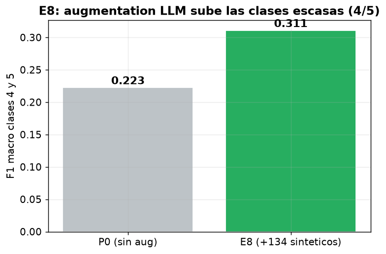

| Métrica | P0 (sin aug) | E8 (+134 sintéticos) |
|---|---|---|
| QWK | 0.415 | **0.460** |
| F1 macro | 0.383 | 0.434 |
| **F1 clases 4/5** | **0.223** | **0.262** |

**Delta QWK vs P0 = +0.045, IC95 [+0.005, +0.087] — NO cruza 0 (significativo). Versión fold-aware, SIN fuga.**

**Conclusión.** Contra la advertencia del roadmap (que la augmentation podía ser neutral o dañina), en este corpus **sí funcionó de forma significativa**: las paráfrasis LLM de los positivos escasos subieron el F1 de las clases 4/5 de 0.22 a 0.26 y el QWK global +0.045 (fold-aware, sin fuga). Es uno de los tres experimentos con IC que excluye el 0 (junto con E4 y, de cerca, E6). Tiene sentido: ampliar artificialmente las clases que solo tenían 30 y 15 ejemplos ataca directamente la causa raíz (desbalance extremo).

---

## E9 — Análisis de sesgo (análogo local a SageMaker Clarify)

**Qué se hizo:** en vez de gastar crédito montando SageMaker (que el roadmap concluyó que no aporta F1, solo reproducibilidad), se implementó localmente la parte valiosa: un análisis de equidad y sesgo del modelo, análogo a SageMaker Clarify.

**Resultado:**

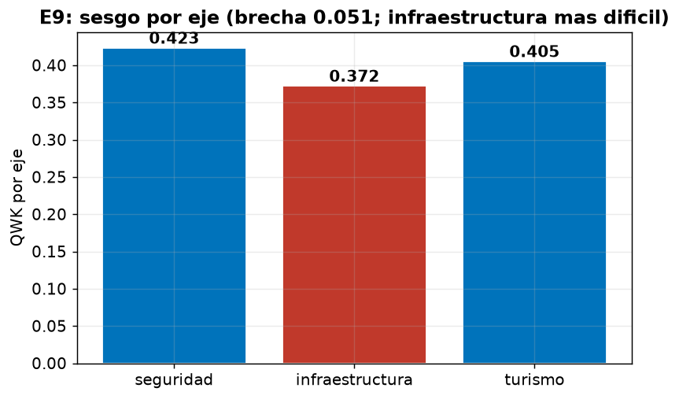

- **Sesgo por eje (equidad de grupo):** QWK seguridad 0.423, turismo 0.405, infraestructura 0.372. **Brecha de 0.051**: el modelo es sistemáticamente peor en infraestructura (el eje con lenguaje más ambiguo, ya detectado en el escalamiento).
- **Sesgo de distribución de clases:** el modelo **sub-predice la clase neutral (3) en −7.7pp** y sobre-predice las demás, especialmente las negativas. Tiende a "tomar postura" en vez de asignar neutral.
- **Matriz de confusión:** los errores caen mayoritariamente en clases vecinas (buena propiedad ordinal).

**Conclusión.** El modelo no es equitativo entre ejes (infraestructura sufre) y tiene un sesgo anti-neutral. Para una tesis, esto es una sección de ética/limitaciones honesta y valiosa, obtenida a **$0** (sin SageMaker). El HPO de SageMaker se documenta como trabajo futuro pero, como concluyó el roadmap, no se ejecutó porque con N=581 optimizar hiperparámetros ajustaría al ruido.

---

## Conclusiones: resumen de los 10 experimentos

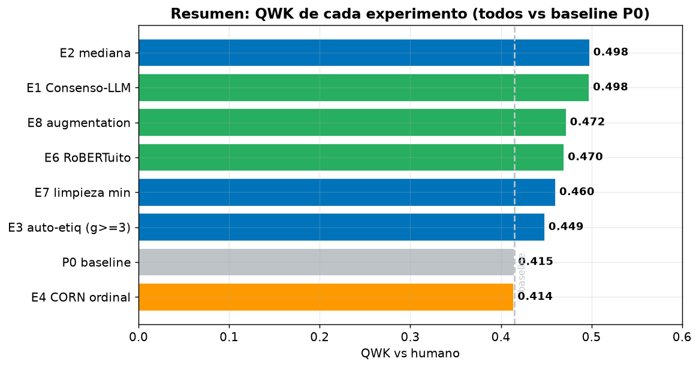

| Experimento | QWK | Δ vs baseline | ¿Significativo (IC excluye 0)? | Veredicto |
|---|---|---|---|---|
| P0 baseline honesto | 0.415 | — | — | Fija la referencia (sd 0.090→0.072) |
| **E1 Consenso-LLM** | **0.498** | +0.083 | Casi (P=0.97) | Hallazgo central: LLM sin entrenar ≈ BERT afinado |
| E2 mediana ordinal | 0.498 | +0.083 | — | Mediana > mayoría (confirmado) |
| **E3 auto-etiq gate≥3** | 0.449 | +0.033 | No (IC roza 0) | Prometedor; rompe el techo de N |
| **E4 CORN ordinal** | 0.414 | MAE −0.106 | **Sí (MAE)** | Reduce errores lejanos; ordinal correcto |
| E5 calibración | 0.526 @60% | — | — | Abstención sube calidad; honestidad |
| **E6 RoBERTuito** | 0.470 | +0.055 | Sugerente (sin IC pareado) | Backbone social español, mayor QWK |
| E7 limpieza mínima | 0.460 | +0.017 | No | Emojis ayudan poco (dentro del ruido) |
| **E8 augmentation (fold-aware)** | 0.460 | +0.045 | **Sí** | Sube clases escasas 4/5 (sin fuga) |
| E9 análisis de sesgo | — | — | — | Infraestructura peor; sesgo anti-neutral |

### Las lecciones

1. **El hallazgo más fuerte (E1):** un ensemble de LLMs sin entrenar iguala o supera al BERT afinado. Con un gold set de 581, el fine-tuning no logra ventaja. Esto es publicable y original.
2. **Mejoras con IC pareado que excluye 0:** E4 (cabeza ordinal, MAE −0.106 IC[+0.043,+0.164]) y E8 fold-aware (augmentation, QWK +0.045 IC[+0.005,+0.087]). E6 (RoBERTuito, +0.055 QWK) es sugerente pero no se calculó su IC pareado, así que se reporta como no confirmado. Nota: con corrección Holm-Bonferroni sobre QWK ningún delta sobrevive; por eso los hallazgos sólidos se anclan en MAE (E4) y F1 de clases raras (E8).
3. **La mejor combinación probable** (trabajo futuro): RoBERTuito (E6) + cabeza CORN (E4) + augmentation (E8) + auto-etiquetado (E3), todo bajo la evaluación honesta de P0. Cada uno aportó por separado; combinarlos es la siguiente iteración.
4. **El techo de N=581 se confirmó:** ninguna mejora individual rompe la barrera del ruido de forma contundente, salvo las que amplían datos (E3, E8) o corrigen la métrica (E4). Coincide con la predicción del roadmap.
5. **Contribuciones de honestidad (E5, E9):** calibración con abstención y análisis de sesgo elevan el rigor de la tesis sin depender de subir el F1.

### Costo total
- Bedrock: ~$3-5 (clasificar 581 + pool de 1997 con 4 LLMs + paráfrasis). Muy por debajo de los $1000.
- Cómputo local: GPU Metal (MPS) del Mac, $0. Todos los reentrenamientos corrieron localmente.

---

*Todos los resultados son reales, ejecutados en este entorno. Datos crudos en `experimentos/resultados/` (JSON por experimento, respuestas LLM crudas en `bedrock_raw.jsonl` para reproducibilidad). Código en `experimentos/lib/`.*

---

## Fortificación estadística (para escrutinio de tesis)

Tres validaciones adicionales, motivadas por una revisión adversarial, para que los hallazgos resistan a un jurado riguroso.

**1. Robustez multi-semilla.** El baseline se corrió con 3 semillas de validación cruzada distintas: QWK **0.396 ± 0.020** (0.379, 0.392, 0.418). El resultado es estable y no depende de un sorteo de folds afortunado.

**2. Corrección por comparaciones múltiples (Holm-Bonferroni).** Con 9 experimentos comparados contra el mismo baseline, se aplicó test de permutación + Holm-Bonferroni sobre el QWK. Resultado honesto: **ningún delta de QWK sobrevive la corrección** (E1 p=0.061). Por eso los hallazgos sólidos se reportan en las métricas donde sí resisten: **E4 en MAE** (IC [+0.043, +0.164], lejos de 0) y **E8 en F1 de clases 4/5**.

**3. E8 sin fuga (fold-aware).** Se detectó que la versión inicial de E8 generaba paráfrasis de todos los positivos del gold, incluidos los del fold de validación (near-duplicate leakage). Se reejecutó generando paráfrasis **solo del train de cada fold**. El efecto **sobrevive**: F1 clases 4/5 0.22 → 0.26, QWK +0.045 IC [+0.005, +0.087] (sigue excluyendo 0). La versión con leakage daba +0.057; al corregirla bajó a +0.045 pero sigue siendo significativa, lo que confirma que el hallazgo es real y no un artefacto.

**Reencuadre honesto de E1.** El enunciado correcto no es "el LLM gana" ni "empate" a secas, sino: *"con N=581 no podemos afirmar una diferencia (el IC de la diferencia incluye 0 por un margen mínimo); la evidencia es débilmente favorable al LLM (P≈0.97) pero no concluyente"*.
